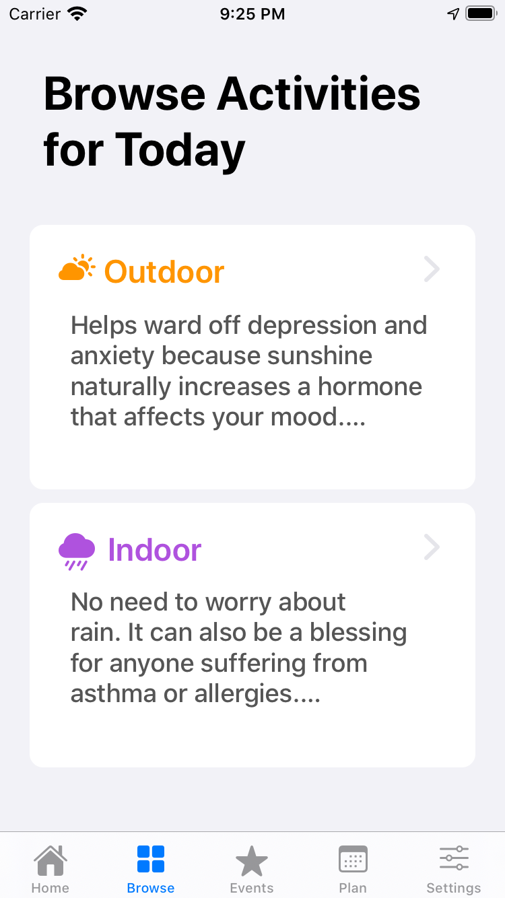
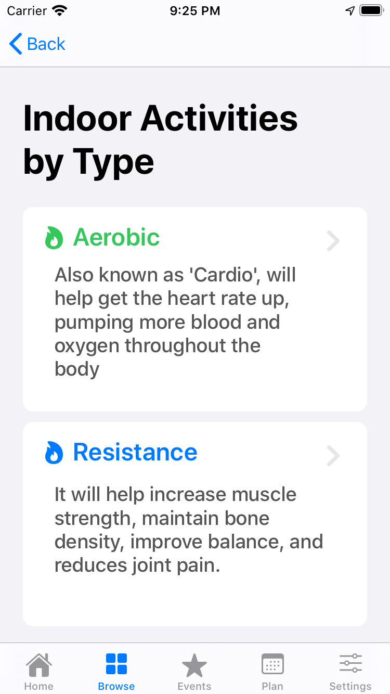
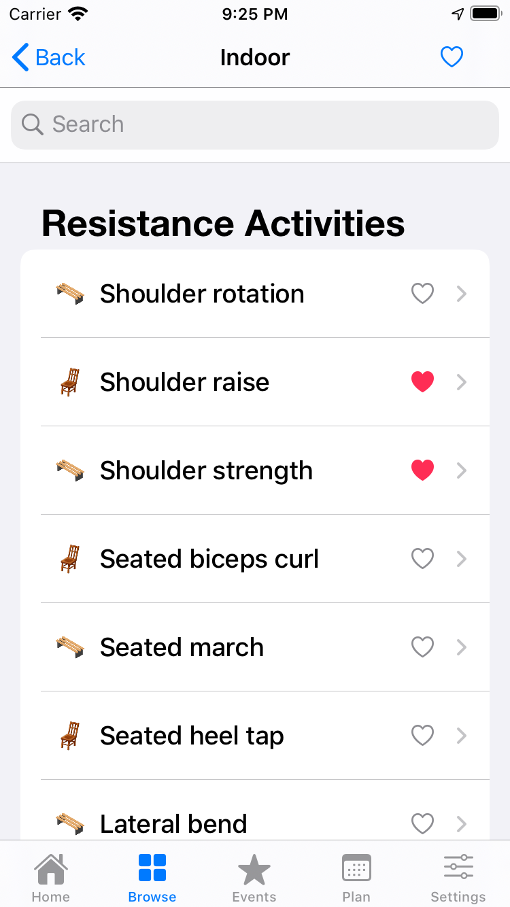
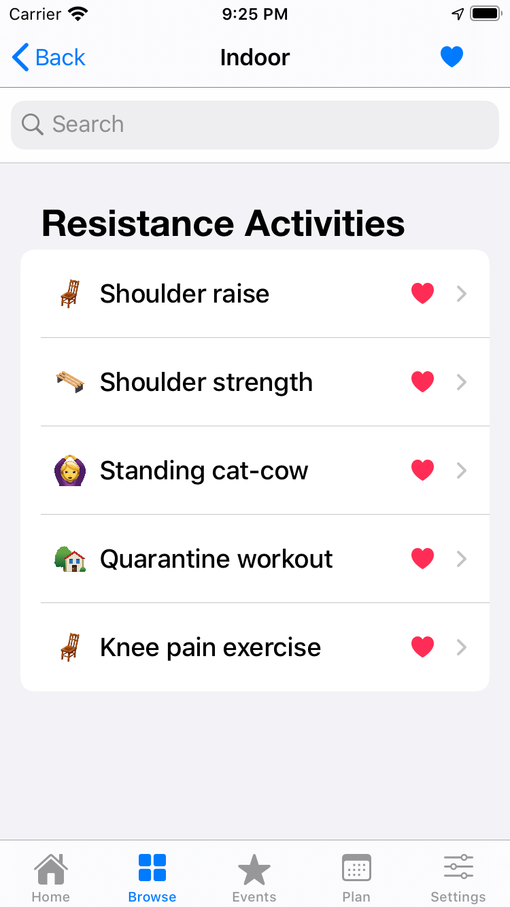
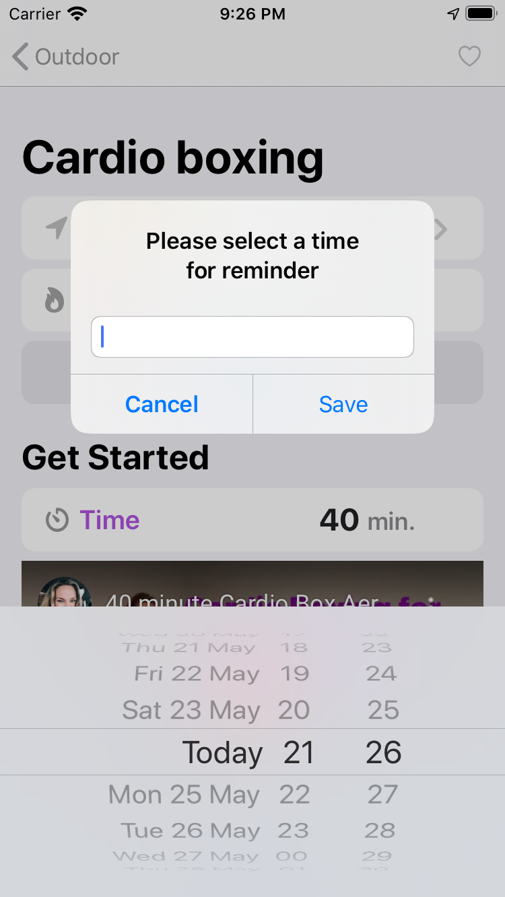
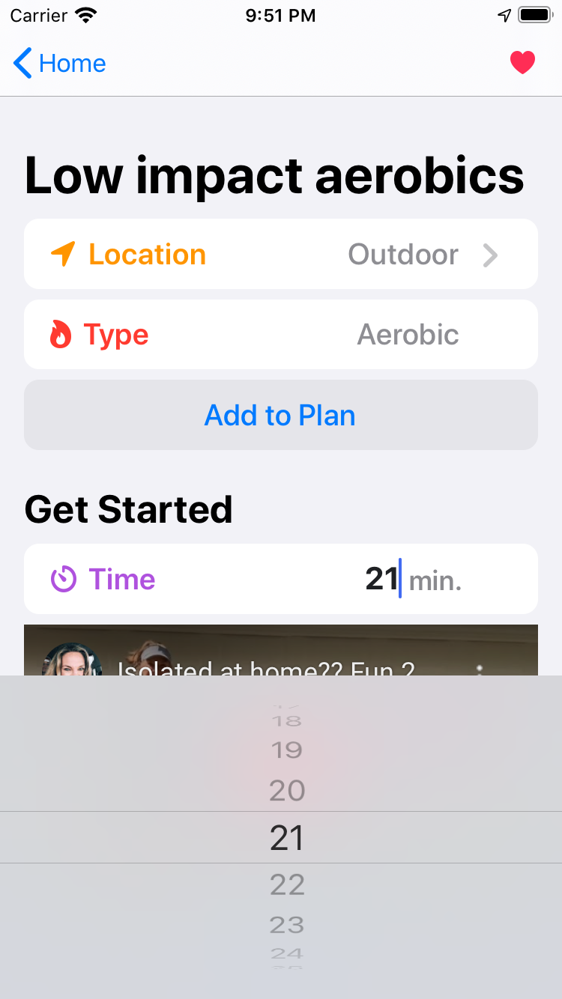
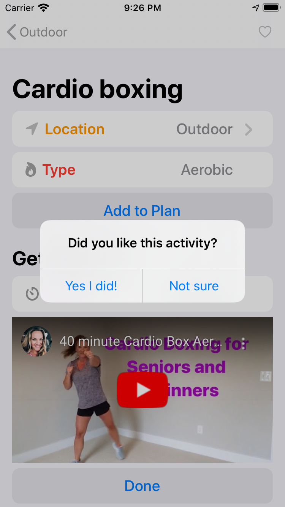
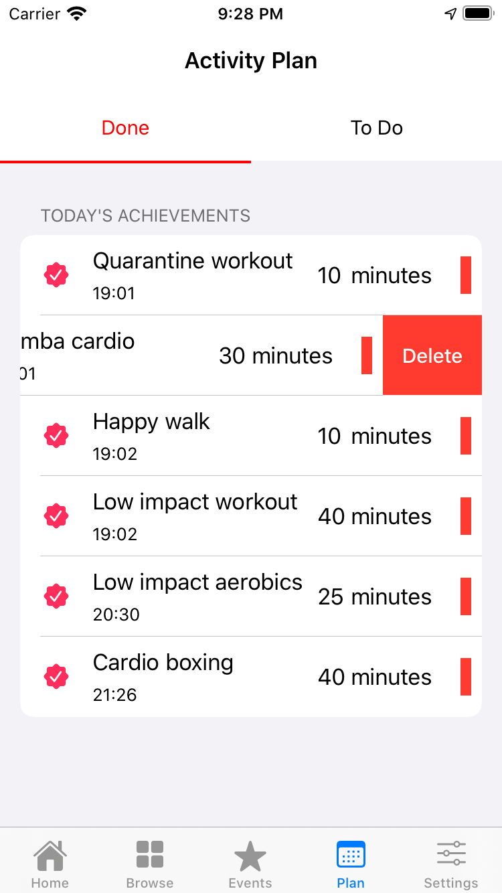
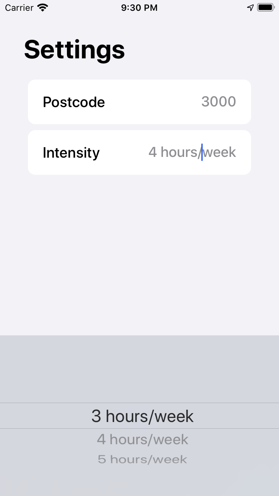

# Just a Quick UI tour
A simple but lovely iOS workout app designed for seniors (or beginners!)

 
 

## 1. Home View
The purpose of the app is very simple and straight forward: helping seniors stay physically active. Let’s get started with the home view.
The home view provides two recommended activities for the day (along with date/weather info at the top) as well as a dashboard that tracks your weekly achievements.

 
 

## 2. Browse View
In addition to the recommendations provided to them in the home view, user can also go directly to the browse view to search for particular exercises that interest them.
 
 
**First level fitler**
 

 
 
**Second level fitler**
 

 
Here’s the full list. 

Clicking on the heart button at the top right corner of the screen, user will be able to filter the full list and see only their favourites.

 
 

## 3. Activity View
When user has made up their mind and decided which activity to they want to do, they simply click on that button, and here comes this activity view.

 
Now, they can either add this activity to the calendar/reminder by clicking on the Add to Plan button and do it at a later time.
 
 

Or they can just do it straight away and track their weekly achievements.

For each activity, user will be given a suggested duration of the workout, but they also have the option to adjust it according to their needs.

 

After hitting the Done button, a quick survey pops out, asking for their feedback, which will further help the app improve its recommendation system (powered by the collaborative filtering algorithm).

 
 

## 4. Plan View / Settings View
Now, in the below plan view, user will be able to see the activities they have done and the ones they planning on doing. 

Meanwhile, user can easily edit and change their workout plan according to their needs.

 
 

## 5. Map View
When an activity is categorised as an outdoor one, there’s a map available for them to explore the area. They will be able to find out all the public open spaces (parks) as well as other essential facilities nearby (eg. hospitals, toilets, seats, water fountains, bike rails, etc.)
We have also implemented day/night mode, providing different feels on different time of the day.

Also, if you click on one of these icons, you will be able to see a popup for more info about that particular location/facility. And if you go ahead and click on the popup, you will be directed to Apple Maps and be able to use their navigation functions directly.
 
 

## 6. Event View
Finally, this lovely app also has an event wall featuring all the fun stuff going on in the area. Oh hey, what a lovely workout app, am I right?(shameless shelf promotion) Now, why don’t you just go ahead and download this app and enjoy it? Cheers to the healthier and happier lifestyle!

